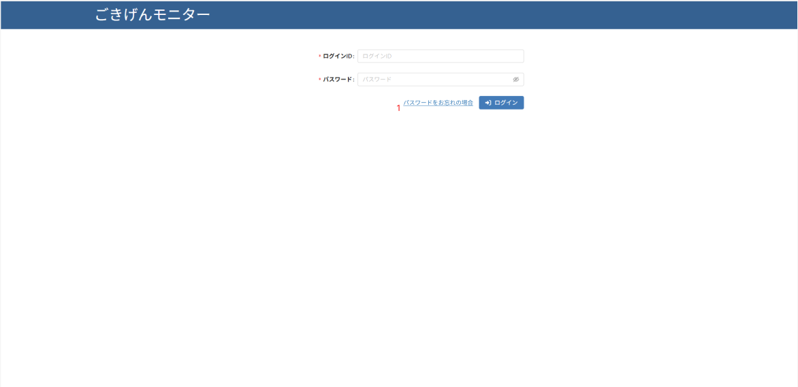
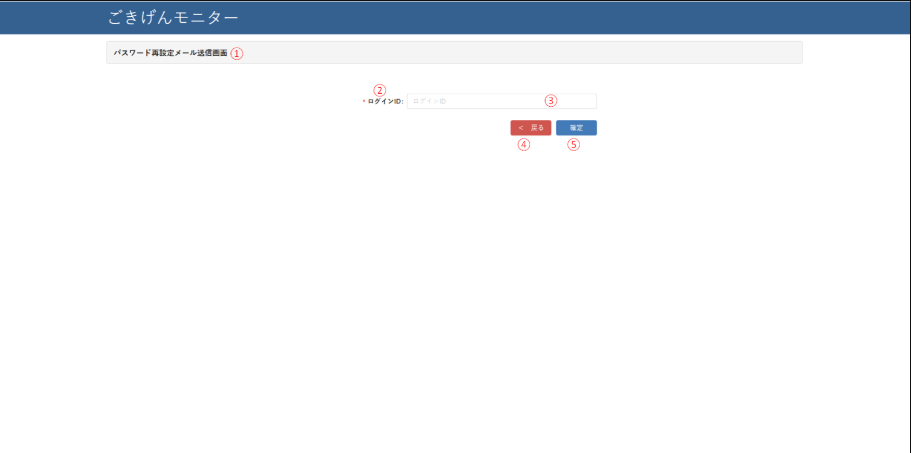
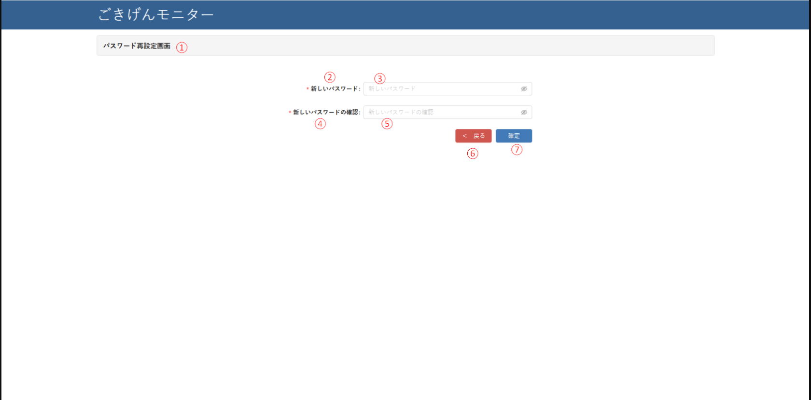
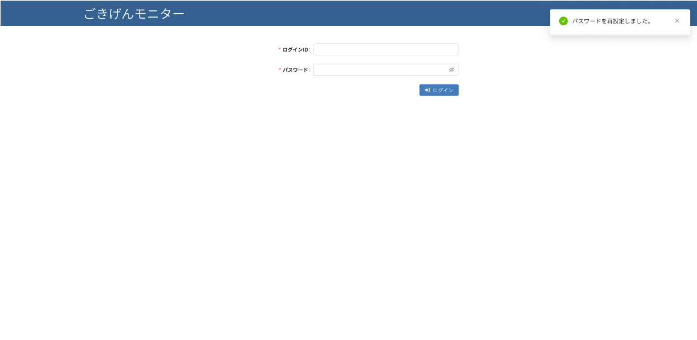
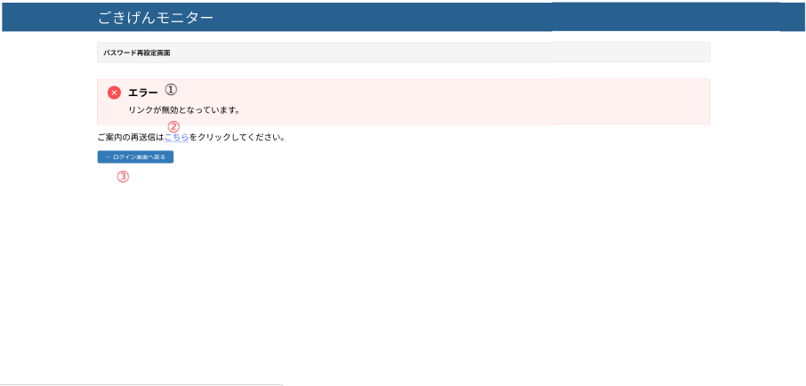

1-ログイン画面
|

  

|

**画面項目説明**
| #  | 項目名               | 属性      | 初期値   | 必須 | 入力チェック | 更新 | フォーマット | 関連データ項目     | 備考  |
|----|------|-----------|-----------|------|--------|------|---------|------------|--------|
| 1  | パスワードをお忘れの場合   | textlink | ー    | ー    | ー             | ー    | ー            | ー      | |

| # | アクション名                         | アクションの処理概要 |
|---|--------------------------------------|------------------------|
|1 |パスワードをお忘れの場合 textlink clicked| 「パスワード再設定メール送信画面」へ遷移する|

2-パスワード再設定メール送信画面

  

**画面項目説明**
| #  | 項目名               | 属性      | 初期値   | 必須 | 入力チェック | 更新 | フォーマット | 関連データ項目     | 備考  |
|----|------|-----------|-----------|------|--------|------|---------|------------|--------|
| 1  |パスワード再設定メール送信画面    | label | ー    | ー    | ー             | ー    | ー            | ー      | |
| 2  |*ログインID：   | label | ー    | ー    | ー             | ー    | ー            | ー||
| 3  | ログインID  | textbox | ー    | O    | ー             | ー    | ー   | ー | プレースホルダー: ログインID |
| 4  | 戻る  | button | ー    | ー    | ー             | ー    | ー            | ー      | |
| 5  | 確定  | button | ー    | ー    | ー             | ー    | ー            | ー      | |

|Item No.| アクション名                         | アクションの処理概要 |
|---|--------------------------------------|------------------------|
|4 | 戻るボタンクリック| ログイン画面に戻る |
|5 | 確定ボタンクリック| **メールアドレスのバリデーションを行い、mStatUserテーブルで存在確認を実施。メールアドレスが存在する場合**  -  画面に処理成功のステータスを返却 - フロントエンドに「パスワード再設定のご案内を送信いたしました。メールをご確認ください。」を表示 バックエンド側で一時的なパスワード再設定用トークンを生成し、それを含むリンクを記載したメールをユーザーに送信 **メールアドレスが存在しない場合：** -「パスワード再設定のご案内を送信いたしました。メールをご確認ください。」を表示 - 注意：メールアドレスが存在しない場合でも、処理成功と同様の表示を行い、情報漏洩を防止 **予期しないエラーが発生した場合：** 他の画面と同様にエラーステータスを返却し、警告を表示 |

3-パスワード再設定画面
  

**画面項目説明**
| #  | 項目名               | 属性      | 初期値   | 必須 | 入力チェック | 更新 | フォーマット | 関連データ項目     | 備考  |
|----|------|-----------|-----------|------|--------|------|---------|------------|--------|
| 1  | パスワード再設定画面   | label | ー    | ー    | ー             | ー    | ー            | ー      | |
| 2  |新しいパスワード   | label | ー    | ー    | ー             | ー    | ー            | ー      | |
| 3  |新しいパスワード  | textbox | ー    | ー    | ー    | ー    | ー  | ー      |プレースホルダー: 新しいパスワード |
| 4  |新しいパスワードの確認   | label | ー    | ー    | ー             | ー    | ー            | ー      | |
| 5  | 新しいパスワードの確認  | textbox | ー| ー| ー| ー    | ー  | ー      | プレースホルダー: 新しいパスワードの確認|
| 6 |  戻る | button | ー    | ー    | ー             | ー    | ー            | ー      | |
| 7  | 確定  | button | ー    | ー    | ー             | ー    | ー            | ー      | |

| # | アクション名                         | アクションの処理概要 |
|---|--------------------------------------|------------------------|
|6 | 戻るボタンクリック| ログイン画面に戻る |
|7 | 確定ボタンクリック|-バックエンドがトークンの有効性と有効期限切れを確認（秘密鍵検証、有効期限、ブラックリスト確認） - 有効な場合: +成功をレスポンス、フロントエンドはパスワード再設定画面を表示   無効な場合:「リンクが無効となっています。」  「ご案内の再送信はこちらをクリックしてください。」（パスワード再設定メール送信画面に遷移、メールアドレスは再入力 |

4-パスワード再設定後画面

  

5-パスワード再設定画面（エラー画面）

  

**画面項目説明**
| #  | 項目名               | 属性      | 初期値   | 必須 | 入力チェック | 更新 | フォーマット | 関連データ項目     | 備考  |
|----|------|-----------|-----------|------|--------|------|---------|------------|--------|
| 1  | エラーのテキスト   | label | ー    | ー    | ー             | ー    | ー            | ー      | |
| 2  | こちら  | textlink | ー    | ー    | ー             | ー    | ー            | ー      | |
| 3  |ログイン画面へ戻る | button | ー    | ー    | ー             | ー    | ー            | ー      | |

| # | アクション名                         | アクションの処理概要 |
|---|--------------------------------------|------------------------|
|1 | こちら clicked|パスワードリセットメール画面に戻り、メールアドレスの再入力を求めます|
|2 | ログイン画面へ戻る clicked|ログイン画面へ戻る|
