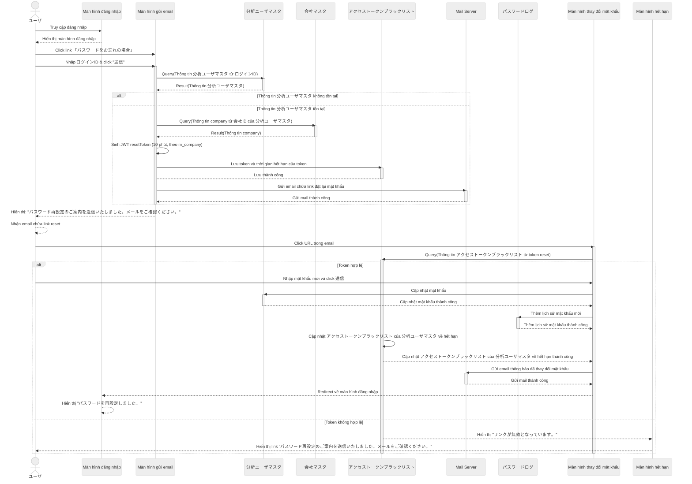

```mermaid
%%{init: {'theme': 'neutral', 'themeVariables': {
  }
}}%%
 
sequenceDiagram
    actor ユーザ
    participant Login as Màn hình đăng nhập
    participant EmailForm as Màn hình gửi email
    participant m_stat_user as 分析ユーザマスタ
    participant m_company as 会社マスタ
    participant t_access_token_blacklist as アクセストークンブラックリスト
    participant Mailer as Mail Server
    participant l_password_log as パスワードログ
    participant ChangePassword as Màn hình thay đổi mật khẩu
    participant ActiveExpired as Màn hình hết hạn
    %% Step 1–3
    ユーザ->>Login: Truy cập đăng nhập
    Login-->>ユーザ: Hiển thị màn hình đăng nhập
    ユーザ->>EmailForm: Click link 「パスワードをお忘れの場合」
    ユーザ->>EmailForm: Nhập ログインID & click "送信"
    activate EmailForm
    %% Step 4: Backend xử lý
    EmailForm->>m_stat_user: Query(Thông tin 分析ユーザマスタ từ ログインID)
    activate m_stat_user
    m_stat_user-->>EmailForm: Result(Thông tin 分析ユーザマスタ)
    deactivate m_stat_user
    alt Thông tin 分析ユーザマスタ không tồn tại
    else Thông tin 分析ユーザマスタ tồn tại
        EmailForm->>m_company: Query(Thông tin company từ 会社ID của 分析ユーザマスタ)
        activate m_company
        m_company-->>EmailForm: Result(Thông tin company)
        deactivate m_company
        EmailForm->>EmailForm: Sinh JWT resetToken (10 phút, theo m_company)
        EmailForm->>t_access_token_blacklist: Lưu token và thời gian hết hạn của token
        activate t_access_token_blacklist
        t_access_token_blacklist-->EmailForm: Lưu thành công
        deactivate t_access_token_blacklist
        EmailForm->>Mailer: Gửi email chứa link đặt lại mật khẩu
        activate Mailer
        Mailer-->>EmailForm: Gửi mail thành công
        deactivate Mailer
    end
    deactivate EmailForm
    EmailForm-->>ユーザ: Hiển thị: "パスワード再設定のご案内を送信いたしました。メールをご確認ください。"
    ユーザ-->>ユーザ: Nhận email chứa link reset
    ユーザ->>ChangePassword: Click URL trong email
    activate ChangePassword
    ChangePassword->>t_access_token_blacklist: Query(Thông tin アクセストークンブラックリスト từ token reset)
    activate t_access_token_blacklist
    alt Token hợp lệ
        ユーザ->>ChangePassword: Nhập mật khẩu mới và click 送信
        ChangePassword->>m_stat_user: Cập nhật mật khẩu
        activate m_stat_user
        m_stat_user-->>ChangePassword: Cập nhật mật khẩu thành công
        deactivate m_stat_user
        ChangePassword->>l_password_log: Thêm lịch sử mật khẩu mới
        activate l_password_log
        l_password_log-->>ChangePassword: Thêm lịch sử mật khẩu thành công
        deactivate l_password_log
        t_access_token_blacklist->>t_access_token_blacklist: Cập nhật アクセストークンブラックリスト của 分析ユーザマスタ về hết hạn
        t_access_token_blacklist-->>ChangePassword: Cập nhật アクセストークンブラックリスト của 分析ユーザマスタ về hết hạn thành công
        ChangePassword->>Mailer: Gửi email thông báo đã thay đổi mật khẩu
        activate Mailer
        Mailer-->>ChangePassword: Gửi mail thành công
        deactivate Mailer
        ChangePassword-->>Login: Redirect về màn hình đăng nhập
        Login-->>Login: Hiển thị "パスワードを再設定しました。"
    else Token không hợp lệ
        t_access_token_blacklist-->>ActiveExpired: Hiển thị "リンクが無効となっています。"
        ActiveExpired-->> ユーザ: Hiển thị link "パスワード再設定のご案内を送信いたしました。メールをご確認ください。"
    end
    deactivate t_access_token_blacklist
    deactivate ChangePassword
```

