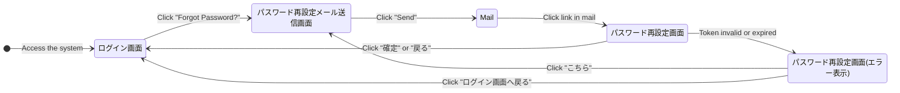

## 画面遷移図

```mermaid

stateDiagram-v2
direction LR
  [*] --> ログイン画面 : Access the system
  ログイン画面 --> パスワード再設定メール送信画面 : Click "Forgot Password?"
  パスワード再設定メール送信画面 --> Mail : Click "Send"
  Mail --> パスワード再設定画面 :Click link in mail
  パスワード再設定画面 --> ログイン画面 : Click "確定" or "戻る"
  パスワード再設定画面 --> パスワード再設定画面(エラー表示) : Token invalid or expired
  パスワード再設定画面(エラー表示) --> パスワード再設定メール送信画面 : Click "こちら"
  パスワード再設定画面(エラー表示) --> ログイン画面 : Click "ログイン画面へ戻る"
```
