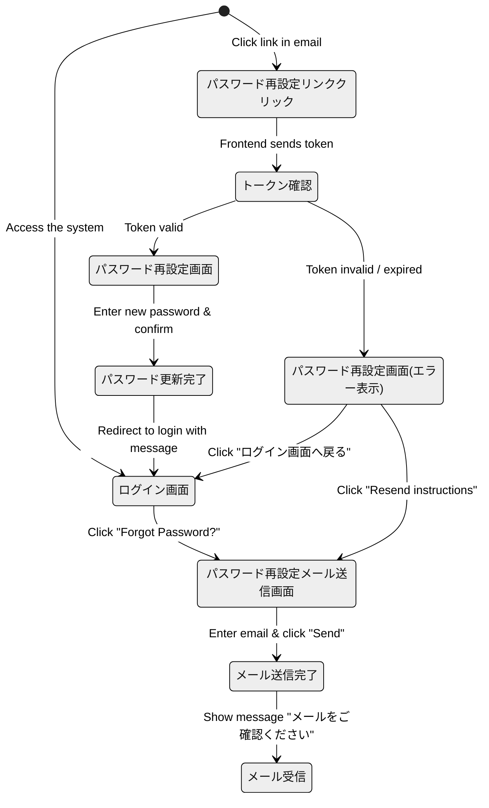

## 画面遷移図

```mermaid

%%{init: {'theme': 'neutral', 'themeVariables': {}}}%%
 
stateDiagram-v2
  [*] --> ログイン画面 : Access the system
  ログイン画面 --> パスワード再設定メール送信画面 : Click "Forgot Password?"
 
  パスワード再設定メール送信画面 --> メール送信完了 : Enter email & click "Send"
  メール送信完了 --> メール受信 : Show message "メールをご確認ください"
 
  [*] --> パスワード再設定リンククリック : Click link in email
  パスワード再設定リンククリック --> トークン確認 : Frontend sends token
 
  トークン確認 --> パスワード再設定画面 : Token valid
  トークン確認 --> パスワード再設定画面(エラー表示) : Token invalid / expired
 
  パスワード再設定画面 --> パスワード更新完了 : Enter new password & confirm
  パスワード更新完了 --> ログイン画面 : Redirect to login with message
 
  パスワード再設定画面(エラー表示) --> パスワード再設定メール送信画面 : Click "Resend instructions"
  パスワード再設定画面(エラー表示) --> ログイン画面 : Click "ログイン画面へ戻る"
```
