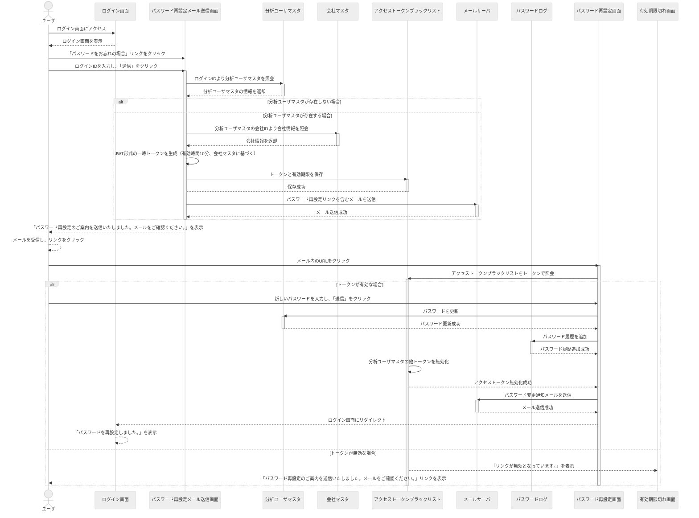

### 概要処理

1-パスワード再設定処理
- 分析ユーザーがパスワード期間切れの場合、ログインID（メールアドレス）あてに再設定通知を送信して、パスワード再設定する
  - パスワードのお忘れ場合のリンクをクリックして、パスワード再設定メール送信画面に遷移する
  - ログインID（メールアドレス）を入力する
  - URLを発行する
  - メールをクリックして、パスワード再設定画面に遷移する
  - パスワードを再設定して、パスワード再設定済みメールを送信する
  - データベースに使用済みトークンとパスワード変更ログを登録する

